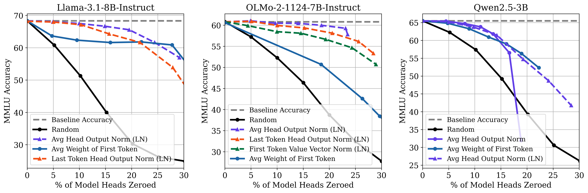

# inactive-heads
We explore [score functions for identifying inactive heads in pretrained LLMs](https://openreview.net/forum?id=dfYMjaiMG4), finding that ~12% of attention heads are inactive, on average. *Can your score function do better?*



Inactive heads can be identified and zeroed with minor performance degradation. For each model and score function, we plot 7 thresholds for the top-3 score functions. The gray dotted line represents baseline accuracy of the pretrained model. The black line represents zeroing out heads uniformly at random. The Avg Head Output Norm (LN) score function is best at identifying the most heads, that when zeroed, maintain accuracy. A better score function would need to identify a larger fraction of heads that, when zeroed, maintain model performance across models.

---

**Update Feb 2026** The "quick start" section is in-progress. I expect to upload the thresholds we used for all score functions by conference presentation. Until then, one can manually select thresholds to test or regenerate them. Still, the main code is viewable in `monkey_patch_*.py` and pseudo code of [Appendix A.12](https://openreview.net/forum?id=dfYMjaiMG4), which shows how all score functions are calculated.

---

## install

Install [lm-evaluation-harness version 0.4.5](https://github.com/EleutherAI/lm-evaluation-harness/tree/v0.4.5) by downloading the repo and executing `pip install -e .`. Install other requirements using `pip install -r requirements.txt`.

## quick start

Assuming access to a SLURM cluster, to re-run the main model intervention experiments from the paper (Sec. 4.3: Verifying Inactive Heads through Model Interventions), run: 

```
python scripts/submit-attention-heads-drop.py;
```

This script will submit jobs for evaluating 7 different thresholds for each model-dataset pair and save results as json files.

## can your score function do better?

To test a new score function, follow these implementation steps:

1. Create a new `HeadType` class in `monkey_patch_head_types.py`. It must be added to `is_supported_head_type`.
2. Generate new CDFs for model/dataset pairs you'd like to evaluate. Run `python scripts/submit-record-head-scores.py` which will save head scores. Then run `python create-CDF.py` to create and save CDFs. A score function simply assigns a number to every attention head. To classify a head as inactive, we need to choose appropriate thresholds. These CDFs ensure that we are able to approximately select the right number of heads (i.e. 5%, 10%, 15%, ...).
3. Monkey-patch the model you're evaluating. For example, modify `my_eager_attention_forward` in `monkey_patch_llama.py` by adding a new condition for your head type. If your score function needs more features than this function has available, you may need to modify other parts of the forward pass. For example, in our [Appendix A.1 of our paper](https://openreview.net/forum?id=dfYMjaiMG4), we consider a circuit-based definition of head output which requires us to measure/modify outputs of the attention module (after output projection `o_proj`). In this case, to implement the `FullHeadOutputNormalized` head type, we had to patch `MyLlamaAttention.forward`.
4. Run `python scripts/submit-attention-heads-drop.py`

## citation

If you find this work useful for your research, please cite our paper:
```
@inproceedings{
sandoval-segura2026identifying,
title={Identifying and Evaluating Inactive Heads in Pretrained {LLM}s},
author={Pedro Sandoval-Segura and Xijun Wang and Ashwinee Panda and Micah Goldblum and Ronen Basri and Tom Goldstein and David Jacobs},
booktitle={The Fourteenth International Conference on Learning Representations},
year={2026},
url={https://openreview.net/forum?id=dfYMjaiMG4}
}
```